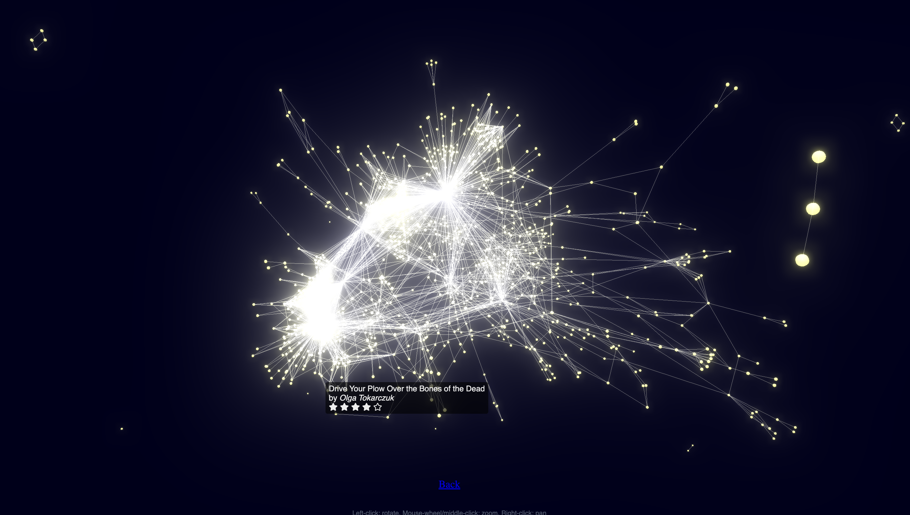
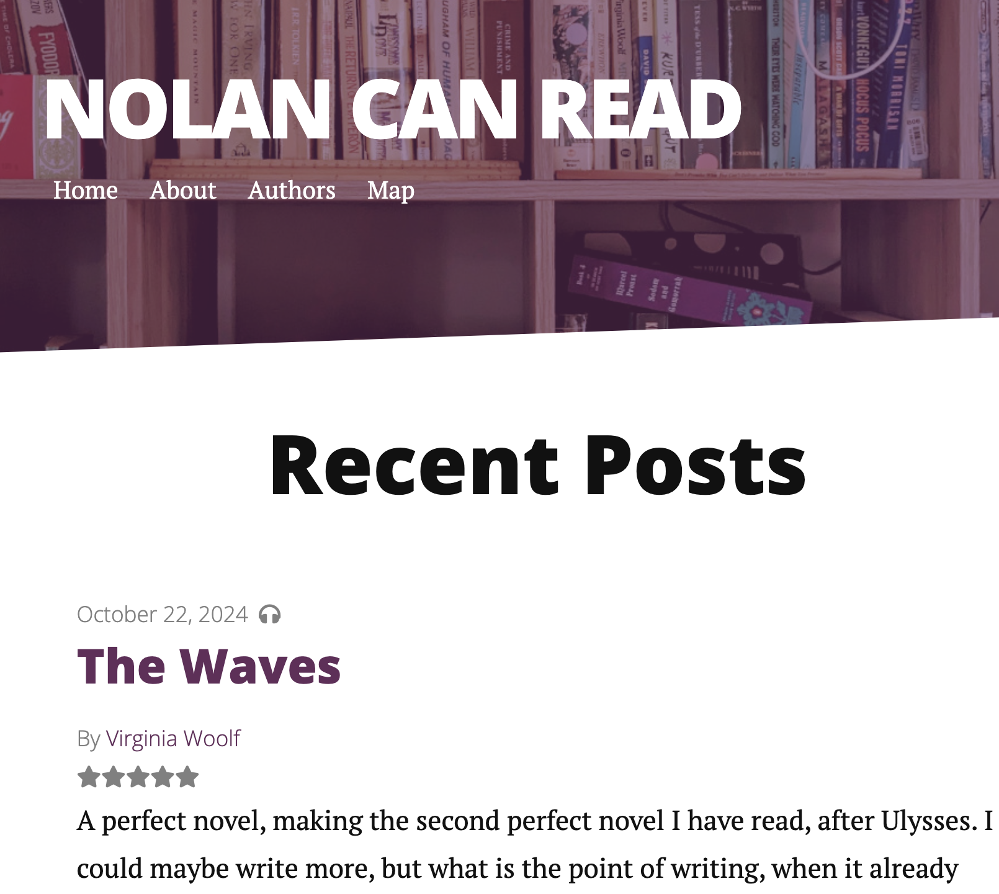
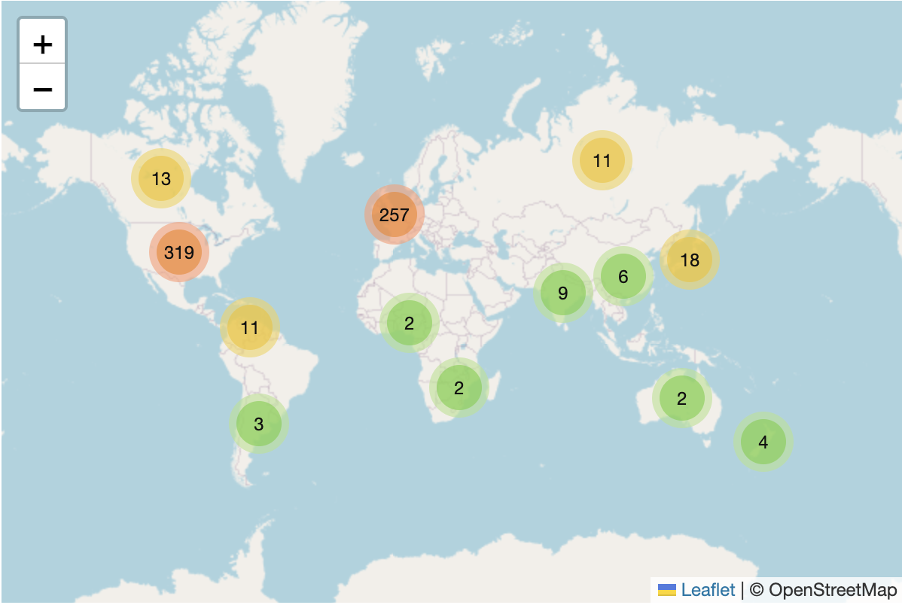
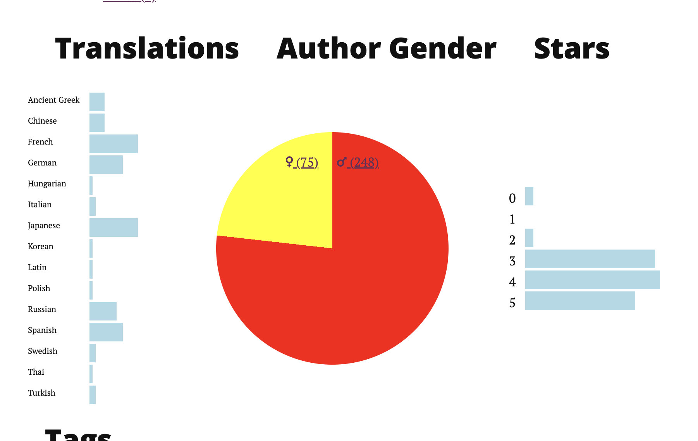

# Nolan Can Read

Since 2014, I have attempted to record every book that I've read and, for the vast majority of them, a star-rating. And occasionally a review even! Now I've got this collection of books and information about them and I wanted to present this in an aesthetically interesting and slightly informational manner.

I started with using Jekyll, because having everything be a static site where I can write up reviews in Markdown seemed like the logical thing to do, resulting in a classy but not terribly fun blogish thing. Then I tried to get clever with it, put almost everything I've ever read on a map, and tried to add all sorts of visualizations, and basically just decided Ruby wasn't the language for me, and things were far too conventional.

After some fiddling and some investigation, I landed on instead generating a static site entirely with vanilla JS, built around a fundamental view of a 3d directed force graph, showing each book I've read, along with many book attributes like authors, languages, locations, and genres as stars, with similarish books closer together and less similar books further away. This was a fun project built on the fantastic and aptly named [3d-directed-force-graph](https://github.com/vasturiano/3d-force-graph) library. I definitely have a lot more tweaking to do to the underlying UI, and my early commitment to doing it all in uncompiled vanilla JS (although still generating paths and stuff) slows the project down a bit, but for the moment it is I think a pretty fun visualization of the data.

## what it used to look like

